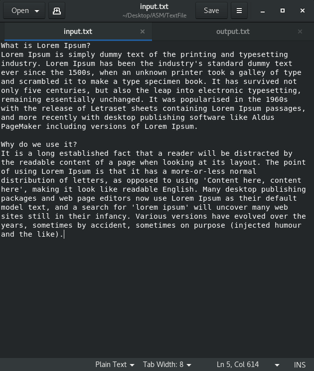
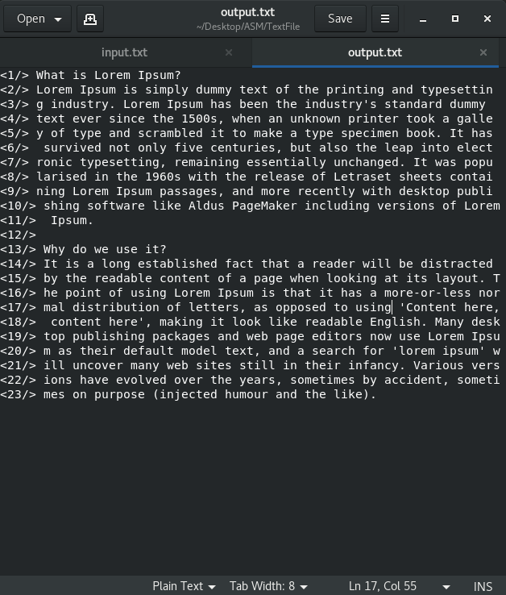

# Line_Count_Adder
It contains an application made up of assembly language which takes a file as input and adds line index to the file at every 64 bytes and records output in another file.   

# Installation
Install Nasm if not preinstalled   
just downaload the zip or clone using
```ruby
git clone https://github.com/AwesomeChap/Line_Count_Adder.git
```
# Usage
Navigate to your cloned folder directory and then,  

Build Using these commands:
```ruby
nasm -f elf -g -F stabs modified_textfile.asm
nasm -f elf -g -F stabs linelib.asm
gcc -m32 textfile.o linlib.o -o modified_textfile
```   

Now, after generating binaries we need to run our program using
```ruby
./modified_textfile input.txt output.txt
```   
<b>NOTE :</b><i>Make sure you have NASM installed in your system</i>  

# Demo   

<b>Input File</b>    

   

<b>Output File generated</b>   



<b>Note: </b><i>This application was build in linux so if you wish to run it on windows you might need do some adjusments. However, Most of the issues should get sloved using Git Bash</i>

